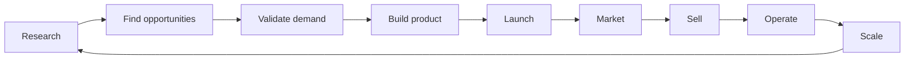

<div align="center">

# Amit

**Building agents that turn ideas into internet businesses.**

I like exploring the internet, finding problems, and building tools I actually want to use.


</div>

---

## 🧭 The Vision

I am working toward an AI system that can create and operate businesses end to end.

Not just “write me a landing page.”

The goal is a system that can move through the whole loop:



The interesting part is not one agent doing one task.

The interesting part is a full operating layer: research agents, product agents, coding agents, marketing agents, sales agents, support agents, analytics, monitoring, and decision loops working together.

## 🧩 What The System Needs

| Area | What it should do |
| --- | --- |
| 🔎 Research | Scan markets, niches, trends, competitors, communities, and pain points |
| 🧪 Validation | Test demand before wasting time building the wrong thing |
| 🛠️ Build | Turn validated ideas into tools, SaaS products, automations, or content systems |
| 📣 Marketing | Create pages, copy, posts, campaigns, SEO angles, and distribution loops |
| 💸 Sales | Package offers, track leads, follow up, and improve conversion |
| 🧾 Operations | Handle docs, support, analytics, maintenance, and recurring workflows |
| 📈 Scaling | Learn what works, double down, cut what fails, and keep improving |

This can become many things: SaaS builder, product studio, automation engine, content machine, research lab, or a personal business operator.

## ⚙️ Current Piece

| Project | What it solves | Why it matters |
| --- | --- | --- |
| [codex-session-monitor](https://github.com/amitwjace-creator/codex-session-monitor) | Watches Codex sessions and alerts when work finishes or needs attention | If agents are doing work, I need visibility. I do not want to babysit terminals. |

This is the first visible building block: agent monitoring, local state, completion alerts, usage data, and a dashboard that makes invisible work visible.

## 🧪 How I Build

I build from problems I personally run into.

```text
notice friction
     ↓
build a small tool
     ↓
use it in real life
     ↓
find what breaks
     ↓
make it sharper
```

I like fast feedback loops. The internet is good for that: find a problem, ship a rough version, see what happens, improve.

## 🧠 Things I Care About

- Agents that actually complete useful work
- Dashboards that show what is happening at a glance
- Automation that creates leverage, not noise
- Local-first tools when the data is personal
- Small products that solve real problems
- Systems that can research, build, launch, and operate

## 🛠️ Stack


JavaScript, Node.js, browser APIs, GitHub Actions, CLI tooling, dashboards, local files, automation scripts, and agent workflows.

## 🚧 Now

Turning this account into a public trail of the system: agent tools, workflow monitors, business automation experiments, and practical software I build because I want to use it.
