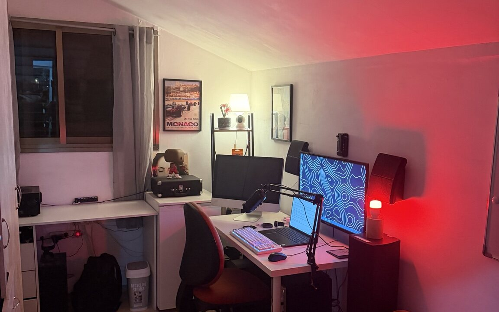
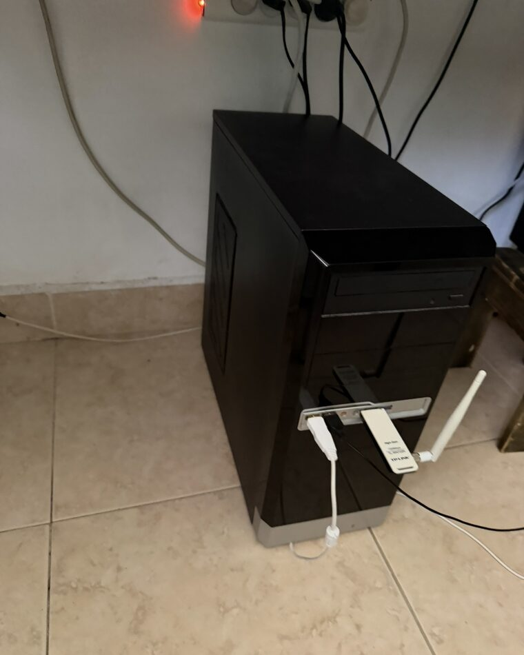
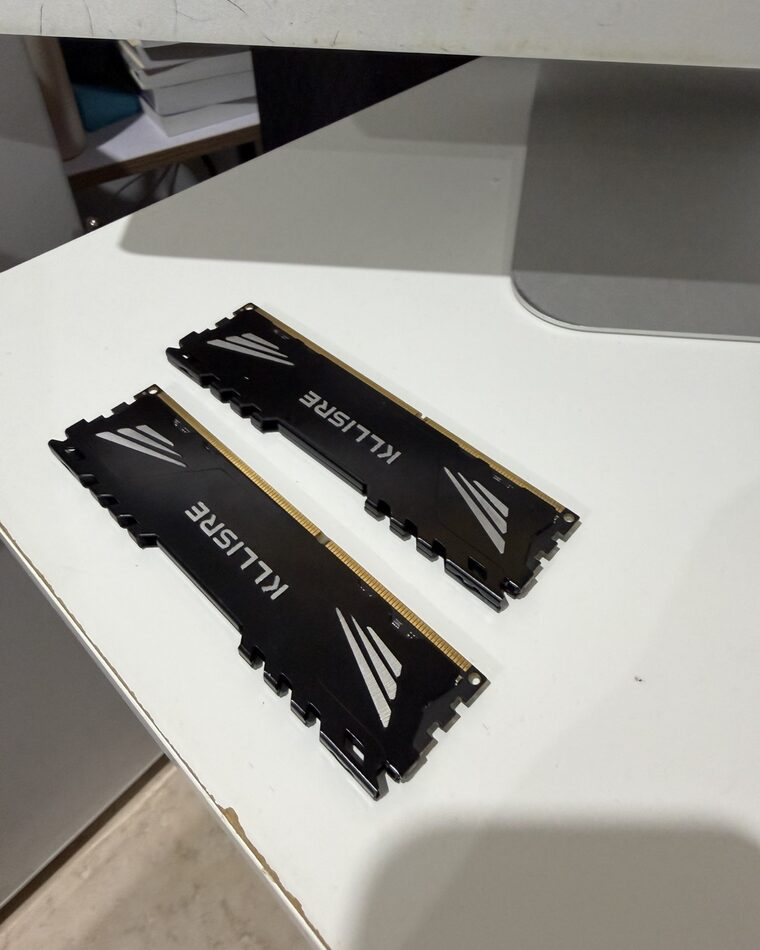
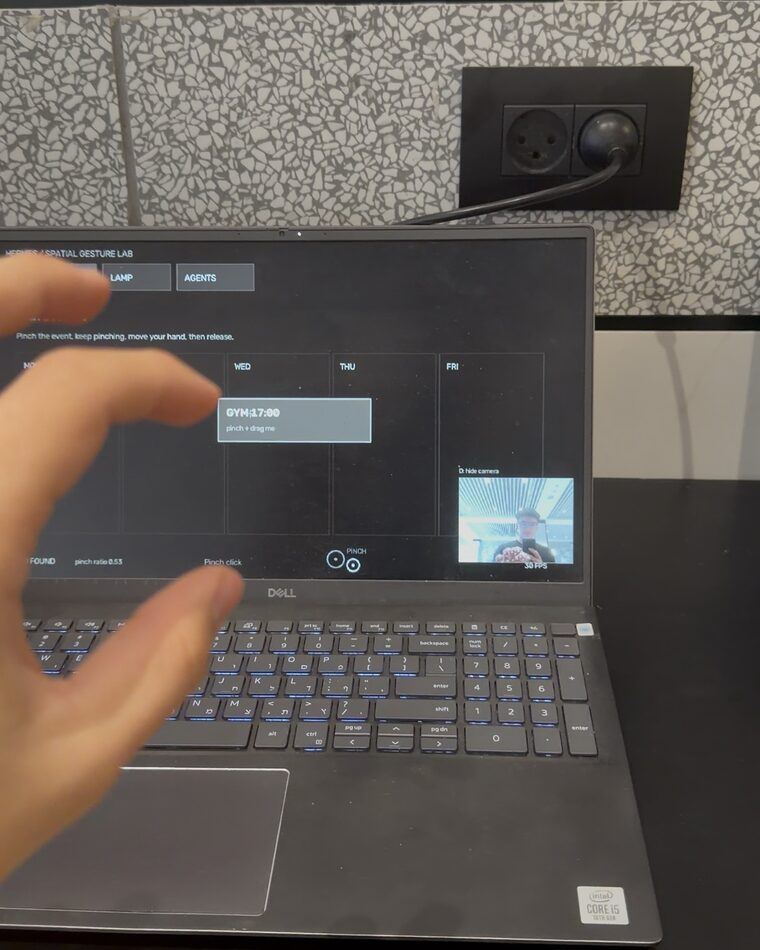

<div align="center">

# AMIT × JACE

### Building a real-world personal AI system, one subsystem at a time.

**AI · Computer Vision · Spatial Interfaces · Automation · Hardware**

*Inspired by the idea behind Tony Stark's lab: technology that understands the room, responds naturally, remembers context, and turns intent into action.*

[](https://github.com/amitwjace-creator)
[](https://github.com/amitwjace-creator/JACE)

<br>



<sub><b>THE CURRENT LAB</b> — a bedroom, a workstation, and the beginning of a real-world AI system.</sub>

</div>

---

## JACE

> **A modular, real-world AI system — not just a chatbot.**

JACE is my long-term attempt to build the kind of computing environment that made Tony Stark's workshop so compelling: **voice, vision, memory, spatial interaction, automation, and hardware behaving as one system.**

The goal is not to recreate a movie prop. It is to take that interaction philosophy and see how much of it can be built with real hardware and software.

### System architecture

| System | Direction |
| :--- | :--- |
| 👁️ **Perception** | Cameras, object detection, people, presence, and scene understanding |
| 🎙️ **Voice** | Wake word, speech recognition, reasoning, and natural responses |
| 🧠 **Memory** | Searchable long-term context, vector retrieval, and Obsidian |
| 🖐️ **Spatial control** | Hand tracking, pointing, pinch, drag, swipe, and two-hand interaction |
| 🏠 **Smart room** | Presence-aware devices, routines, and physical-world automation |
| 📽️ **Interface** | A projected, spatial JARVIS-style workspace |
| ⌚ **Wearable** | An always-available endpoint and memory capture layer |
| 🔌 **Integrations** | Connecting JACE to the software and services around me |

---

## What exists today

### 🖐️ Spatial Gesture Lab

The most developed physical-interface part of JACE so far.

Built with **OpenCV + MediaPipe**, the current prototypes support real-time hand tracking, pointing, pinch, drag, swipe, point-hold context, and two-hand transformations.

```text
CAM      29–30 FPS
AI       27–30 FPS
UI       58–61 FPS
LATENCY  ~45–65 ms result age
```

I am also experimenting with **OpenVINO** optimization and a precision-focused Object Pointer prototype.

<sub>My public <a href="https://github.com/amitwjace-creator/barehands">barehands repository</a> is an experimental fork of <a href="https://github.com/jaredrhod/barehands">Jared Rhodenizer’s original project</a>. JACE’s Gesture Lab and Object Pointer are being developed separately inside the JACE repository.</sub>

### 🤖 Agent infrastructure

**[codex-session-monitor](https://github.com/amitwjace-creator/codex-session-monitor)** explores the observability layer for autonomous agents: surfacing session state, usage, and completion without babysitting terminals.

---

## The lab

JACE is being built as a physical system as much as a software project. Cameras provide perception, microphones provide voice input, local machines run services, displays and projectors provide spatial feedback, and custom electronics become physical endpoints.

<table>
<tr>
<td width="33%" align="center"></td>
<td width="33%" align="center"></td>
<td width="33%" align="center"></td>
</tr>
<tr>
<td align="center"><b>01 · Local infrastructure</b><br><sub>An old PC repurposed as JACE’s always-on local server.</sub></td>
<td align="center"><b>02 · Hardware upgrade</b><br><sub>16 GB RAM upgrade for real workloads.</sub></td>
<td align="center"><b>03 · Spatial prototype</b><br><sub>Early MediaPipe testing: pinching and dragging UI elements by hand.</sub></td>
</tr>
</table>

> JACE did not begin in a research lab. It began here: repurposed hardware, a laptop camera, and the decision to turn a cinematic idea into working systems — one prototype at a time.

---

## Roadmap

- [x] Establish the JACE repository and architecture
- [x] Recover and organize gesture-control prototypes
- [x] Build a tuned real-time Gesture Lab
- [x] Build the Object Pointer precision prototype
- [x] Start OpenVINO optimization
- [ ] Reliable always-on voice interface
- [ ] Long-term memory + Obsidian/vector retrieval
- [ ] Room perception pipeline
- [ ] Smart-room control layer
- [ ] Projected spatial interface
- [ ] Wearable JACE endpoint
- [ ] Connect the subsystems into one continuous experience

---

## Building philosophy

I am interested in the point where **AI stops being a tab in a browser and becomes infrastructure around you**.

I like projects where software has to interact with messy reality: cameras, latency, microphones, local machines, physical spaces, human gestures, and imperfect hardware.

<div align="center">

**build → use → notice friction → measure → improve → connect**

</div>

I would rather have an imperfect prototype running in my room than a perfect idea sitting in a document.

---

## Stack

<p align="center">

</p>

<p align="center">
Computer Vision · MediaPipe · OpenCV · OpenVINO · AI Agents · Local-first Systems · Vector Search · Automation · Spatial Interfaces · Embedded Hardware
</p>

---

## Public projects

| Project | What it explores |
| :--- | :--- |
| **[codex-session-monitor](https://github.com/amitwjace-creator/codex-session-monitor)** | Local-first dashboard and completion-alert system for Codex CLI sessions |
| **[barehands — experimental fork](https://github.com/amitwjace-creator/barehands)** | A fork of [Jared Rhodenizer’s original project](https://github.com/jaredrhod/barehands) used to study hand-tracked spatial interfaces |

<sub>The main JACE repository is private because the project has a strict boundary between public code and personal data.</sub>

---

## Principles

```text
01  Build things I genuinely want to use.
02  Prototype before over-planning.
03  Measure latency, reliability, and real-world behavior.
04  Keep personal data local and private by default.
05  Make each subsystem useful on its own.
06  Then connect the pieces.
07  Ship the progress, not just the final result.
```

---

## Build with me

I am especially interested in collaborating around **computer vision & HCI, local AI infrastructure, agent tooling, physical computing, sensors, wearables, and projected interfaces**.

Good starting points are available in **[codex-session-monitor issues](https://github.com/amitwjace-creator/codex-session-monitor/issues)**.

---

## Connect

If you are building in **AI agents, computer vision, HCI, spatial computing, robotics, embedded systems, or local AI**, I would like to hear about it.

<div align="center">

[](https://www.instagram.com/amitbenshachar/)
[](https://github.com/amitwjace-creator)

<br>

### *“Build the interface you wish existed.”*

**JACE is the long game. This profile is the build log.**

</div>
